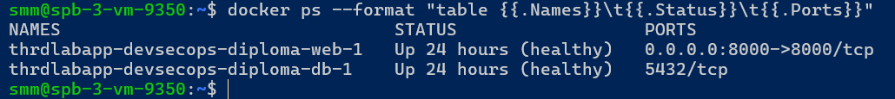
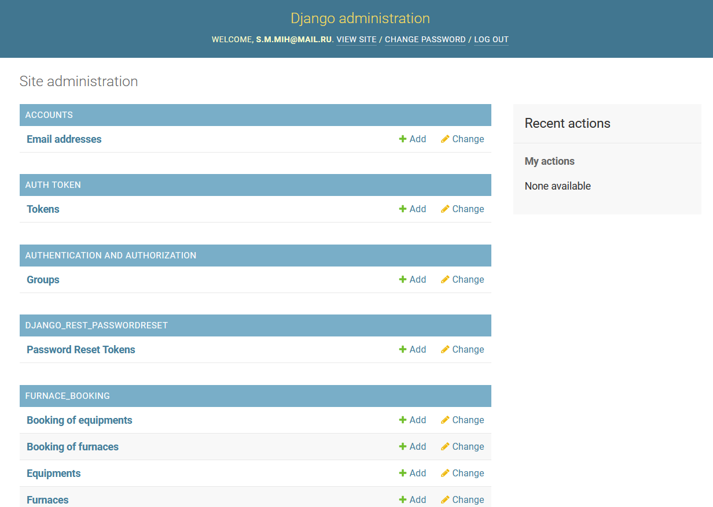
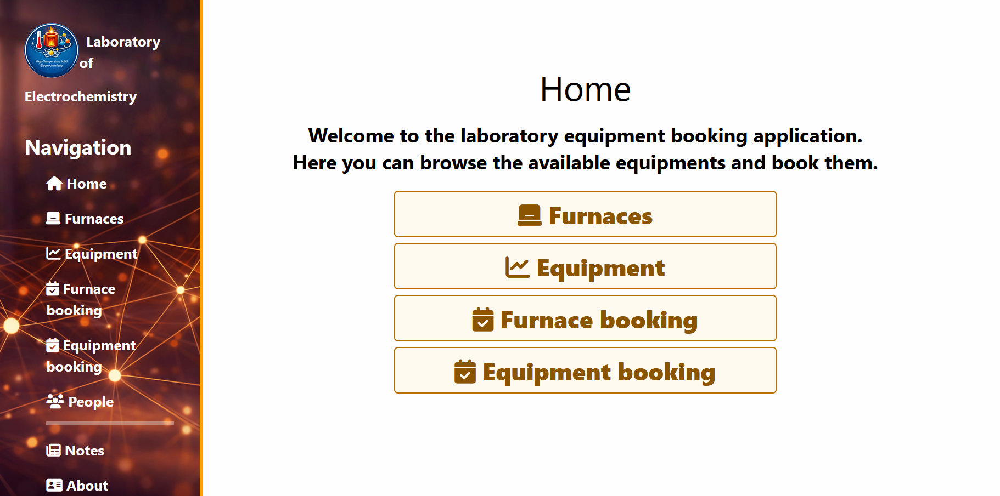

# Information Security Specialist Diploma Project — Sergey Mikhalev

A diploma project for the **DevSecOps** course.

The goal is to build a secure CI/CD pipeline for a web application, with automated security checks and a mechanism for blocking unsafe releases.

Project assignment: [sib-Diplom-Track-DevSecOps](https://github.com/netology-code/sib-Diplom-Track-DevSecOps)

Original repository of the application used for this project: [THRDLabApp](https://github.com/sergeMMikh/thrdlabapp.git).

---

## Work Plan

The project follows the stages of the diploma assignment in sequence.

### Stage 0. Preparing the Environment and the Initial Project

Tasks:

- create a separate repository for the diploma project;
- provision a training VPS;
- configure SSH access using keys;
- restrict network access with UFW;
- containerize the application;
- prepare a `Dockerfile` and `docker compose` configuration;
- move configuration and secrets into environment variables;
- deploy the application and PostgreSQL on the training host;
- verify that the application is accessible externally;
- document the initial state of the project and infrastructure.

Stage outcomes:

- the application can be deployed reproducibly on the training VPS;
- PostgreSQL is accessible only within the Docker network;
- only the required services are exposed externally;
- secrets are not stored in the repository.

<details>
<summary>Screenshots</summary>

<br>
Docker containers running on the target host

<br>

Web application

<br>

Django administration panel

<br>

Git repository connections

<br>

</details>

Project resources:

- [Original project](https://github.com/sergeMMikh/thrdlabapp.git)
- [GitLab](https://gitlab.com/sergeMMikh/thrdlabapp-devsecops-diploma.git)
- [Docker Hub](https://hub.docker.com/repository/docker/sergemmikh/thrdlabapp-devsecops-diploma/general)

### Stage 1. CI/CD

Assignment criteria:

1. A configured software build and delivery pipeline.
2. Deployment to a remote server.
3. A documented process.

#### Implemented Architecture

[**GitLab CI/CD**](https://gitlab.com/sergeMMikh/thrdlabapp-devsecops-diploma.git) runs the pipeline, [**Docker Hub**](https://hub.docker.com/repository/docker/sergemmikh/thrdlabapp-devsecops-diploma/general) stores the built container images, and a training VPS serves as the deployment target.

A key architectural decision at this stage is **not to build the application on the target server**. The Docker image is a ready-to-use, versioned artifact: it is built in CI, published to Docker Hub, and delivered to the VPS after the preceding stages have passed.

Basic pipeline sequence:

```text
validate
   |
   v
auth
   |-- Docker Hub authentication
   `-- SSH authentication
   |
   v
lint
   |
   v
test (pytest)
   |
   +----------------------+----------------------+
   |                      |                      |
   v                      v                      v
SAST: Bandit         SAST: Semgrep          build:image
   |                      |                      |
   +----------------------+----------------------+
                          |
                          v
                       deploy
                          |
                          v
                security:check-connection
                          |
                          v
                security:zap-baseline
```

The Docker image is published with a tag corresponding to the commit SHA, providing traceability:

```text
Git commit
    |
    v
GitLab pipeline
    |
    v
Docker image:<commit-sha>
    |
    v
Training VPS
```

The production Compose configuration uses a prebuilt `image:` rather than a local `build:`. PostgreSQL stores its data in a persistent Docker volume, so recreating the application container and deploying a new image does not recreate the database. On startup, Django applies only pending migrations.

Using a container image as the primary deployment artifact also allows the same image to be deployed to Kubernetes in the future without changing the application delivery approach.

#### Automated pytest Tests

A dedicated CI job, `test`, runs before the build and security analysis. Pytest is configured in `setup.cfg`, and tests are located in the `tests` directory. Results are published in GitLab CI as a JUnit report (`pytest-report.xml`) and retained as an artifact.

Chromium and ChromeDriver are also installed in CI because the test suite includes a Selenium check that loads the home page in a headless browser.

The current pytest suite covers:

- **Models and database constraints (`tests/main/test_models.py`)** — creating regular users and superusers, required email/password fields, model string representations, email token generation and uniqueness, relationships between Person and Furnace/Equipment, booking uniqueness, news values and URLs, object updates, and cascading deletion of related records;
- **Core Django views (`tests/main/test_views.py`)** — rendering Home/About/Contacts, grouping furnaces by laboratory, displaying recent news, creating news with valid and invalid data, and news detail/update/delete operations;
- **User API (`tests/users/test_user_views.py`)** — successful and unsuccessful registration, name and email length limits, login for verified users, rejection of login for unverified users, account confirmation, email verification, authentication requirements for profile editing, user updates, and password reset requests and confirmation;
- **Selenium (`tests/main/test_test.py`)** — running headless Chromium against Django's `live_server` and checking that the home page and its title load;
- a basic smoke test of the pytest environment.

The Docker image build starts only after lint and functional tests have passed. This prevents code that fails basic functional checks from reaching subsequent stages.

#### Runner Separation

Three GitLab Runner registrations with the Docker executor run on the continuously available WSL host `DEM-PC1064`. Global runner manager concurrency is configured with `concurrent = 3`.

Roles are separated using tags:

```text
Build runner
  tags: thrdlabapp, docker, build
  jobs: validate, Docker Hub auth, lint, pytest, build:image

SAST runner
  tags: thrdlabapp, security, sast
  jobs: Bandit, Semgrep

DAST runner
  tags: thrdlabapp, security, dast
  jobs: HTTPS availability check, OWASP ZAP Baseline Scan
```

The build runner uses `privileged = true`, which is required for Docker-in-Docker. Security runners operate without privileged mode unless a specific check requires it.

A network restriction was discovered while configuring CD: the university network hosting the main self-hosted WSL runner blocks outbound connections to the target VPS's SSH port. This limitation was identified late in the setup process. SSH authentication and deployment therefore run on a GitLab-hosted runner with network access to the target server. DAST runs on the self-hosted DAST runner over the standard HTTPS port, 443.

#### Responsibilities

```text
GitHub                — primary repository for the project and documentation
GitLab                — CI/CD pipeline
DEM-PC1064 Build      — lint, pytest, Docker build/push
DEM-PC1064 SAST       — Bandit, Semgrep
DEM-PC1064 DAST       — HTTPS pre-check, OWASP ZAP
GitLab-hosted Runner  — deployment transport to the VPS
Docker Hub            — registry for prebuilt Docker images
VPS                   — target deployment environment
```

#### Completed Work

- created a GitLab repository and configured it as a separate Git remote;
- prepared `.gitlab-ci.yml`;
- configured protected CI/CD variables;
- added a separate check for required variables;
- verified Docker Hub authentication and SSH authentication to the VPS;
- configured dedicated self-hosted GitLab Runners with the Docker executor;
- implemented lint using a separate `requirements-lint.txt`;
- added automated pytest execution with JUnit report publication;
- installed Chromium and ChromeDriver in the CI environment for the Selenium test;
- configured Docker image builds after successful lint and pytest checks;
- published images to Docker Hub with commit SHA tags;
- prepared `compose.prod.yaml` to use a prebuilt Docker image;
- configured automated deployment over SSH;
- configured PostgreSQL to use a persistent Docker volume;
- verified that the Django application works on the training VPS after automated deployment.

### Stage 2. SAST

Assignment criteria:

1. Source code coverage by security checks.
2. Automatic execution of checks during the build process.
3. Export of results to CI or a vulnerability management system.

#### Tool Selection

Two complementary tools are used for SAST:

- **Bandit** — a security analyzer specifically for Python code;
- **Semgrep** — a rule-based SAST analyzer with a broader set of rules for Python/Django and web application patterns.

Bandit is installed from a separate `requirements-security.txt` so that security tooling is kept separate from application runtime dependencies. Semgrep runs in its own container image.

#### Implementation in GitLab CI/CD

Two CI jobs were added:

```text
sast:bandit
sast:semgrep
```

Both are assigned to the dedicated SAST runner using the tags `thrdlabapp, security, sast`.

After `test` succeeds, the pipeline permits three independent branches to run:

```text
                         +--> sast:bandit -----> bandit-report.json
                         |
test --------------------+--> sast:semgrep ----> semgrep-report.json
                         |
                         +--> build:image ------> Docker Hub
```

These jobs use `needs: [test]`, allowing SAST and the build to run in parallel when runner slots are available.

Analyzer results are retained in GitLab CI as artifacts for one week:

```text
bandit-report.json
semgrep-report.json
```

During the initial SAST rollout, findings **do not block a release**. Stage 2 aims to provide reproducible automated analysis, establish a baseline, classify findings, and distinguish confirmed issues from false positives. In Stage 5 (Security Gateway), SAST results and other security checks will be evaluated by severity and may block a release.

Current stage status:

- Bandit is integrated into GitLab CI/CD;
- Semgrep is integrated into GitLab CI/CD;
- SAST runs automatically after pytest;
- reports are retained as CI artifacts;
- report-only mode is enabled while the baseline is being established.

### Stage 3. DAST

Assignment criteria:

1. Dynamic security checks covering the running service.
2. Successful execution of the available scanning methods.
3. Export of results to CI or a vulnerability management system.

#### HTTPS Endpoint for Dynamic Analysis

For DAST, the application is published under the dedicated DNS name **`diploma.smmikh.pt`** and is accessible over HTTPS on the standard port, 443.

**Nginx** is installed on the training VPS in front of Django/Gunicorn and acts as a reverse proxy:

```text
Internet / DAST runner
        |
     HTTPS :443
        |
        v
      Nginx
        |
        v
  Django / Gunicorn :8000
        |
        v
    PostgreSQL
```

Gunicorn is not used as the public HTTPS entry point. External access to port 8000 is blocked by UFW; only the standard web ports, 80/443, are exposed for the application. Port 80 is used for HTTP/ACME and redirects to HTTPS, while the application's operational endpoint and DAST use HTTPS/443.

The TLS certificate for `diploma.smmikh.pt` was issued by **Let's Encrypt** and installed in Nginx. The TLS chain was verified, and automatic certificate renewal was tested with `certbot renew --dry-run`. This allows the DAST runner and OWASP ZAP to access the environment over trusted HTTPS without disabling certificate validation or adding a self-signed CA.

#### DAST Implementation in GitLab CI/CD

Dynamic analysis uses **OWASP ZAP Baseline Scan**. The scan runs on the dedicated runner `DEM-PC1064-3` with the following tags:

```text
thrdlabapp, security, dast
```

Two sequential stages run after deployment:

```text
deploy:production
       |
       v
security:check-connection
       |
       v
security:zap-baseline
       |
       +--> zap-report.json
       +--> zap-report.html
       `--> zap-report.md
```

`security:check-connection` performs a quick HTTPS pre-check using `curl`. If the application is unavailable, dynamic analysis does not start. This distinguishes network or infrastructure failures from security scanner results.

After the availability check succeeds, `security:zap-baseline` starts the official OWASP ZAP container and performs passive/baseline analysis of the deployed application. Reports are retained as GitLab CI artifacts for one week in three formats:

```text
zap-report.json
zap-report.html
zap-report.md
```

At this stage, ZAP operates in **report-only** mode: findings are retained and analyzed, but warnings do not yet block a release. The blocking policy will be implemented in Stage 5 (Security Gateway).

#### Baseline Scan Results

The first successful baseline scan processed **29 application URLs**. ZAP reported:

```text
FAIL-NEW: 0
WARN-NEW: 12
PASS: 55
```

The baseline scan did not identify any critical `FAIL` results. It established a baseline of 12 warning types, including:

- cookies without `HttpOnly`;
- cookies without `Secure`;
- missing HSTS (`Strict-Transport-Security`);
- missing Content Security Policy (CSP);
- missing Permissions Policy;
- potentially controllable HTML attributes (Potential XSS);
- cache-control/cacheable content issues;
- Cross-Domain Misconfiguration;
- missing Subresource Integrity for some resources;
- additional browser isolation/security headers.

These findings are not automatically treated as confirmed vulnerabilities. In subsequent stages, they will be classified, checked for false positives, and assessed against the acceptable risk level.

#### Stage Outcomes

- the deployed application is accessible to the DAST runner over trusted HTTPS;
- the Nginx reverse proxy and Let's Encrypt certificate are configured;
- external access to application port 8000 is blocked, and DAST uses HTTPS/443;
- a separate application availability pre-check is implemented;
- OWASP ZAP Baseline Scan is integrated into GitLab CI/CD;
- DAST runs automatically after deployment;
- the baseline scan successfully processed 29 URLs;
- DAST results are retained as JSON/HTML/Markdown artifacts;
- the baseline is `0 FAIL`, `12 WARN`, `55 PASS`;
- the pipeline including Stage 3 completed successfully.

### Stage 4. Security Checks

Assignment criteria:

1. Scanning the repository for secrets.
2. Checking configuration or container images.

Implementation plan:

- secret scanning — TruffleHog;
- dependency scanning — pip-audit and/or Trivy;
- container image scanning — Trivy;
- Dockerfile / configuration checks;
- CI/CD and deployment configuration checks;
- SBOM generation if required;
- retention of reports as artifacts.

Areas covered:

```text
source code
    |
    +-- secrets
    +-- dependencies
    +-- configuration
    +-- Dockerfile
    +-- container image
    +-- CI/CD configuration
```

#### Pipeline Optimization for Development by Stage

As CI/CD expanded, the full pipeline grew to include lint, functional tests, SAST, Docker image build and publication, deployment, DAST, and additional security checks. A complete run began to take considerable time — up to 10 minutes in some cases. To speed up development, major diploma stages were developed in separate protected branches with shorter pipelines.

Stage 4 uses the `stage_4` branch. Pushes to this branch run only the checks relevant to Security Checks, skipping the previously implemented lint/test/SAST/build/deploy/DAST jobs. Once the stage is complete, its changes are integrated into `main`, where the full integration pipeline runs all stages.

This approach shortens the feedback cycle when developing individual security jobs and reduces unnecessary runner load while preserving a mandatory full check of the integrated solution on the main branch.

#### Security Checks Implementation

The following checks have been added at this stage:

- **TruffleHog** — scans the repository's Git history for secrets and saves results to `trufflehog-report.json`;
- **pip-audit** — checks Python dependencies in `requirements.txt` for known vulnerabilities and saves results to `pip-audit-report.json`;
- **Trivy filesystem scan** — analyzes the repository filesystem for vulnerable dependencies, secrets, and misconfigurations, saving results to `trivy-fs-report.json`;
- **Trivy config scan** — separately checks the Dockerfile and infrastructure configuration, saving results to `trivy-config-report.json`.

In Stage 4, security scanners generate reports and retain them as CI artifacts. Trivy also scans the current commit's Docker image after the build (`trivy-image-report.json`). Release blocking decisions are handled by the separate Security Gateway in Stage 5.

### Stage 5. Security Gateway

Assignment criteria:

1. Blocking a release when unacceptable vulnerabilities are present.
2. Additional automated actions: MR comments and remediation recommendations.

Implementation plan:

- define release acceptance rules;
- block deployment when security scans report critical results;
- define acceptable `Critical`, `High`, `Medium`, and `Low` severity levels;
- aggregate SAST, DAST, secret scanning, and container scanning results;
- display a clear Security Summary in GitLab CI/CD;
- publish information about issues in merge requests;
- document exceptions and false positives.

Target pipeline design:

```text
push to a working branch
        |
        +--> lint
        `--> pytest

Merge Request --> main
        |
        +--> lint / pytest
        +--> Bandit / Semgrep
        +--> TruffleHog
        +--> pip-audit
        +--> Trivy fs/config
        `--> Security feedback in MR

merge / push --> main
        |
        +--> full set of checks
        +--> build:image
        +--> Trivy image
        |
        v
Security Gateway
        |
   +----+----+
   |         |
 BLOCK      PASS
             |
             v
           Deploy
             |
             v
            DAST
```

Production deployment is permitted only from the `main` branch. The Security Gateway blocks deployment when verified secrets or HIGH/CRITICAL findings are detected by blocking checks. Medium/Low findings and results without a reliable severity mapping are retained for analysis and do not automatically block a release.

Merge requests trigger an extended set of source-level security checks, and a Security Summary with recommendations is published automatically through the GitLab API. Production Docker image builds and publication remain restricted to the trusted `main` branch pipeline so that registry credentials are not exposed to code from arbitrary working branches.

#### Verifying Release Blocking and Remediating Vulnerabilities

During the first integrated Security Gateway run, Trivy's container and filesystem analysis detected unacceptable HIGH/CRITICAL findings. The `security:gateway` job failed, and the dependent stages `deploy:production`, `security:check-connection`, and `security:zap-baseline` did not start. This demonstrates that the release gate actually stops an unsafe release before it reaches production.


The Gateway report included vulnerabilities in the outdated dependency `Django==4.0.4`. Remediation included upgrading to the supported Django 5.2 LTS branch while maintaining compatibility with Python 3.10, which was used in CI at that point.

A version management error was also discovered during remediation: the initially specified version, `Django==5.2.18`, had not yet been published. `pip install -r requirements.txt` correctly stopped the pipeline with `No matching distribution found for Django==5.2.18`; the version available in the package index being used was `5.2.17`. The dependency was corrected to `Django==5.2.17`, after which the pipeline was expected to rerun functional and security checks before allowing deployment.

Security check results and the final Security Gateway report are retained as GitLab CI/CD artifacts, including `security-gateway-report.md`, `security-gateway-report.json`, and the original scanner reports. The Gateway uses `artifacts: when: always`, so diagnostic material is preserved even when a release is blocked and remains available for subsequent analysis and remediation.

Stage 5 therefore demonstrates the complete cycle: **detection → release blocking → root cause analysis → remediation → verification**.

After the identified issues and dependency problems were resolved, the final pipeline passed all checks.


The subdomain `diploma.smmikh.pt` was configured. The resulting web application is available at https://diploma.smmikh.pt/



### Results and Final Documentation

The diploma project delivered a complete DevSecOps pipeline for a Django application, combining functional checks, Docker image builds and publication, automated deployment, and multiple layers of security analysis.

The CI/CD pipeline integrates:

- lint and automated pytest tests;
- SAST using Bandit and Semgrep;
- secret scanning with TruffleHog;
- Python dependency auditing with pip-audit;
- filesystem, configuration, and container image analysis with Trivy;
- DAST of the running HTTPS application with OWASP ZAP;
- a Security Gateway that determines whether a release may proceed to deployment;
- retention of check results and final security reports as GitLab CI artifacts;
- Security Summaries and recommendations for merge requests.

Practical verification demonstrated that the release gate does more than generate reports. When HIGH/CRITICAL findings were detected, the Security Gateway stopped the pipeline before production deployment. Scan results were retained as artifacts and used for root cause analysis.

Remediation included upgrading the vulnerable Django version and resolving identified dependency issues for which fixes were available. Subsequent checks showed that CRITICAL findings had been eliminated, and pip-audit and Trivy filesystem results met the acceptance criteria. Remaining container image findings were assessed against the availability of fixes and the release acceptance policy.

After remediation, the pipeline successfully completed all stages: functional checks, security scans, the Security Gateway, deployment, and subsequent DAST. This demonstrated the complete DevSecOps cycle:

**code change → CI → automated security checks → Security Gateway → remediation if required → verification → deployment → DAST.**

The final implementation provides reproducible application builds and delivery, preserves evidence of completed checks, and prevents automatic deployment of releases that do not meet the defined security criteria.

---

## Planned and Implemented Tools

| Task | Tool |
|---|---|
| Source / documentation | GitHub |
| CI/CD | GitLab CI/CD |
| CI runners | Self-hosted GitLab Runner / WSL / Docker executor |
| Deployment runner | GitLab-hosted Runner |
| Container registry | Docker Hub |
| Containerization | Docker / Docker Compose |
| Reverse proxy / HTTPS | Nginx / Let's Encrypt / Certbot |
| Functional tests | pytest, Selenium, Chromium |
| Web application | Django / Gunicorn |
| Database | PostgreSQL |
| SAST | Semgrep, Bandit |
| Dependency scanning | pip-audit, Trivy |
| Secret scanning | TruffleHog |
| Container scanning | Trivy |
| DAST | OWASP ZAP |
| Security reports | GitLab CI artifacts / reports |
| Security Gateway | GitLab CI jobs, rules and release conditions |

The listed tools constitute the final toolset used to implement the DevSecOps pipeline.

---

## Working Principles

Pipeline development follows these rules:

- each stage is implemented and verified separately first;
- the Docker image is the primary versioned delivery artifact;
- the target server is not used as an application build environment;
- security checks are part of CI/CD rather than a separate manual process;
- real secrets are not committed to Git or included in Docker images;
- check results are retained and available for analysis;
- identified vulnerabilities are analyzed as well as recorded;
- false positives are documented;
- critical issues must be able to stop a release;
- deployment credentials are available only to jobs that actually need them;
- all key decisions and results are documented.

---

## Progress Status

| Stage | Status |
|---|---|
| 0. Environment preparation | Completed |
| 1. CI/CD | Completed: lint, pytest, build, and deployment |
| 2. SAST | Completed: Bandit and Semgrep integrated; reports retained in CI |
| 3. DAST | Completed: HTTPS endpoint, pre-check, and OWASP ZAP Baseline Scan integrated |
| 4. Security Checks | Completed: TruffleHog, pip-audit, Trivy filesystem/config, and container image scanning |
| 5. Security Gateway | Completed: release gate, MR feedback, artifact retention, and blocking of unsafe deployment |

All stages of the diploma project are complete; this README documents the final architecture, check results, and evidence of the DevSecOps pipeline in operation.
