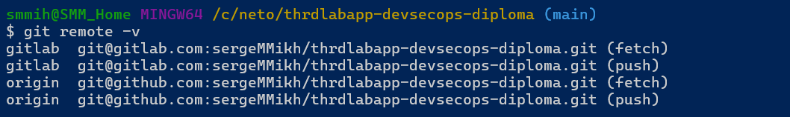
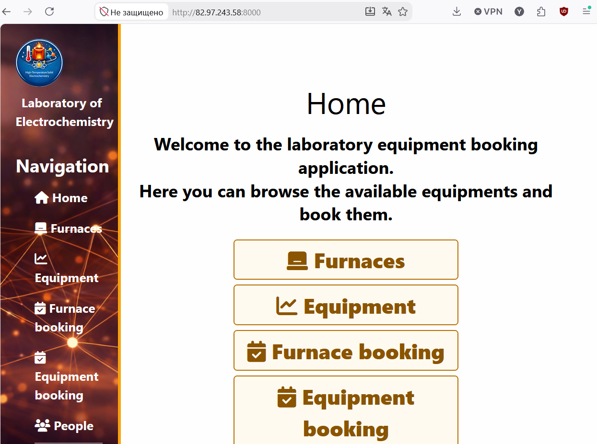

# THRDLabApp DevSecOps Diploma

Дипломный проект по треку **DevSecOps**.

Цель работы — построить безопасный CI/CD-пайплайн для веб-приложения с автоматизированными проверками безопасности и механизмом остановки небезопасного релиза.

Задание Нетологии: [sib-Diplom-Track-DevSecOps](https://github.com/netology-code/sib-Diplom-Track-DevSecOps)

Исходный репозиторий приложения: _будет добавлен позже_.

---

## План работы

Работа выполняется последовательно по этапам дипломного задания.

### Этап 0. Подготовка стенда и исходного проекта

Задачи:

- подготовить отдельный дипломный репозиторий;
- развернуть учебный VPS;
- настроить SSH-доступ по ключу;
- ограничить сетевой доступ с помощью UFW;
- контейнеризировать приложение;
- подготовить `Dockerfile` и `docker compose`;
- вынести конфигурацию и секреты в переменные окружения;
- развернуть приложение и PostgreSQL на учебном хосте;
- проверить доступность приложения извне;
- зафиксировать исходное состояние проекта и инфраструктуры.

Результат этапа:

- приложение воспроизводимо разворачивается на учебном VPS;
- PostgreSQL доступен только внутри Docker-сети;
- наружу опубликованы только необходимые сервисы;
- секреты не хранятся в репозитории.

<details> 
<summary>Скриншоты</summary>

</br>
</br>
</br>
</br>

</details>

Ссылки на репозитории поекта:
* [Исходный проект](https://github.com/sergeMMikh/thrdlabapp.git)
* [GitLab](https://gitlab.com/sergeMMikh/thrdlabapp-devsecops-diploma.git)
* [DockerHub](https://hub.docker.com/repository/docker/sergemmikh/thrdlabapp-devsecops-diploma/general)


### Этап 1. CI/CD

Критерии задания:

1. настроенный пайплайн сборки и доставки программного обеспечения;
2. использование удалённого сервера для развёртывания;
3. документированный процесс.

#### Выбранная архитектура

Для CI/CD используется **GitLab CI/CD**, для хранения собранных контейнерных образов — **Docker Hub**, а целевой средой развёртывания является учебный VPS.

Принципиальное решение этапа — **не собирать приложение на целевом сервере**. Docker-образ является готовым версионируемым артефактом: он собирается в CI, публикуется в Docker Hub и только после успешного прохождения pipeline доставляется на VPS.

```text
Developer
    |
    | git push
    v
GitLab repository
    |
    +--> lint
    |
    +--> tests
    |
    +--> Docker build
    |        |
    |        v
    |    Docker Hub
    |    image:<commit-sha>
    |        |
    +--------+
    |
    v
GitLab deploy job
    |
    | SSH :2217
    v
Training VPS
    |
    +--> docker compose pull
    |
    +--> docker compose up -d
    |
    v
Healthcheck
```

Таким образом, исходный код не требуется собирать непосредственно на целевом сервере. Сервер получает тот же контейнерный артефакт, который был создан и проверен в CI.

Docker-образы планируется версионировать по commit SHA, например:

```text
<dockerhub-user>/thrdlabapp:<commit-sha>
```

Это обеспечивает связь между исходным кодом, результатом pipeline и реально развёрнутой версией приложения, а также позволяет выполнить откат на предыдущий проверенный образ.

Использование контейнерного образа как основного deployment artifact также оставляет возможность в дальнейшем использовать тот же образ для развёртывания приложения в Kubernetes, если это потребуется для развития проекта. Таким образом, выбранная схема не привязывает приложение только к Docker Compose на одном VPS.

#### Разделение ответственности

```text
GitHub      — основной репозиторий проекта и документации
GitLab      — CI/CD pipeline
Docker Hub  — registry готовых Docker-образов
VPS         — целевая среда развёртывания
```

Для работы с GitHub и GitLab предполагается использовать один локальный Git-репозиторий с отдельными remote. CI/CD выполняется на стороне GitLab.

#### План реализации этапа

- создать GitLab-репозиторий для CI/CD;
- подключить его как дополнительный Git remote;
- подготовить `.gitlab-ci.yml`;
- запускать lint и тесты приложения;
- собирать Docker-образ только после успешных проверок;
- аутентифицироваться в Docker Hub через CI/CD variables;
- публиковать образ с тегом commit SHA;
- подготовить production Compose, использующий `image:`, а не локальный `build:`;
- настроить SSH-доставку на учебный VPS через порт `2217`;
- выполнять на сервере `docker compose pull` и `docker compose up -d`;
- выполнять healthcheck после deployment;
- сохранять результаты pipeline как evidence.

Первоначальная последовательность pipeline:

```text
lint
  |
  v
tests
  |
  v
Docker build
  |
  v
Docker Hub
  |
  v
deploy VPS
  |
  v
healthcheck
```

По мере выполнения следующих этапов диплома этот же pipeline будет расширяться security-проверками и постепенно преобразовываться в полноценный DevSecOps pipeline.

### Этап 2. SAST

Критерии задания:

1. покрытие исходного кода проверками;
2. автоматический запуск проверок во время сборки;
3. выгрузка результатов в CI или систему управления уязвимостями.

План реализации:

- выполнить статический анализ Python/Django-кода;
- использовать несколько подходящих инструментов, например Semgrep и Bandit;
- запускать SAST автоматически в GitLab CI/CD;
- сохранять отчёты как artifacts;
- провести анализ найденных проблем и ложных срабатываний.

Цель — покрыть проверками весь применимый исходный код проекта.

### Этап 3. DAST

Критерии задания:

1. покрытие работающего сервиса динамическими проверками;
2. успешный запуск доступных методов сканирования;
3. выгрузка результатов в CI или систему управления уязвимостями.

План реализации:

- выполнять DAST против развернутого приложения на учебном стенде;
- использовать OWASP ZAP;
- выполнить baseline scan;
- при необходимости добавить authenticated/API scan;
- сохранять HTML/JSON/XML отчёты как CI artifacts;
- разобрать обнаруженные уязвимости и false positive результаты.

Целевая схема:

```text
GitLab CI/CD
      |
      v
   deploy
      |
      v
training VPS
      |
      v
  OWASP ZAP
      |
      v
DAST report
```

### Этап 4. Security Checks

Критерии задания:

1. проверка репозитория на секреты;
2. проверка конфигурации или контейнерных образов.

План реализации:

- secret scanning — Gitleaks;
- dependency scanning — pip-audit и/или Trivy;
- container image scanning — Trivy;
- Dockerfile / configuration checks;
- проверка CI/CD и deployment-конфигурации;
- формирование SBOM при необходимости;
- сохранение отчётов в artifacts.

Контролируемые области:

```text
source code
    |
    +-- secrets
    +-- dependencies
    +-- configuration
    +-- Dockerfile
    +-- container image
    +-- CI/CD configuration
```

### Этап 5. Security Gateway

Критерии задания:

1. остановка релиза при наличии недопустимых уязвимостей;
2. дополнительные автоматизированные действия: комментарии в MR и рекомендации по исправлению.

План реализации:

- определить правила допуска релиза;
- блокировать deployment при критических результатах security scans;
- определить допустимые уровни `Critical`, `High`, `Medium`, `Low`;
- агрегировать результаты SAST, DAST, secret scanning и container scanning;
- выводить понятный Security Summary в GitLab CI/CD;
- публиковать информацию о проблемах в merge request;
- документировать исключения и false positives.

Целевой pipeline:

```text
                         +--> SAST -----------+
                         |                    |
commit --> lint --> tests+--> Secret Scan ----+--> Security Gateway --> Build --> Docker Hub --> Deploy
                         |                    |
                         +--> SCA ------------+
                                              |
Docker image ----------------> Image Scan ----+
                                              |
                                              +--> block release
                                              +--> report
                                              +--> MR feedback
```

### Этап 6. Анализ результатов и итоговая документация

После реализации pipeline необходимо:

- собрать результаты всех проверок;
- классифицировать обнаруженные проблемы;
- отделить подтверждённые уязвимости от false positives;
- оценить риски и приоритет исправления;
- описать remediation;
- зафиксировать архитектуру итогового DevSecOps pipeline;
- собрать evidence работы каждого этапа;
- подготовить итоговое описание дипломного проекта.

---

## Планируемые инструменты

| Задача | Инструмент |
|---|---|
| Source / documentation | GitHub |
| CI/CD | GitLab CI/CD |
| Container registry | Docker Hub |
| Containerization | Docker / Docker Compose |
| Future orchestration | Kubernetes (при необходимости) |
| Web application | Django / Gunicorn |
| Database | PostgreSQL |
| SAST | Semgrep, Bandit |
| Dependency scanning | pip-audit, Trivy |
| Secret scanning | Gitleaks |
| Container scanning | Trivy |
| DAST | OWASP ZAP |
| Security reports | GitLab CI artifacts / reports |
| Security Gateway | GitLab CI jobs, rules and release conditions |

Состав инструментов может уточняться по мере выполнения работы. Для каждого выбранного средства в итоговой документации будет указана причина выбора и область покрытия.

---

## Принципы выполнения работы

При разработке pipeline придерживаемся следующих правил:

- каждый этап сначала реализуется и проверяется отдельно;
- Docker-образ является основным версионируемым артефактом доставки;
- целевой сервер не используется как build-среда приложения;
- security checks являются частью CI/CD, а не отдельной ручной процедурой;
- реальные секреты не коммитятся в Git и не включаются в Docker image;
- результаты проверок сохраняются и доступны для анализа;
- найденные уязвимости не только фиксируются, но и анализируются;
- false positives документируются;
- критические проблемы должны иметь возможность остановить релиз;
- все ключевые решения и результаты отражаются в документации.

---

## Статус выполнения

| Этап | Статус |
|---|---|
| 0. Подготовка стенда | В работе |
| 1. CI/CD | Проектирование |
| 2. SAST | Не начат |
| 3. DAST | Не начат |
| 4. Security Checks | Не начат |
| 5. Security Gateway | Не начат |
| 6. Итоговая документация | Не начат |

README будет обновляться по мере прохождения этапов дипломной работы.
