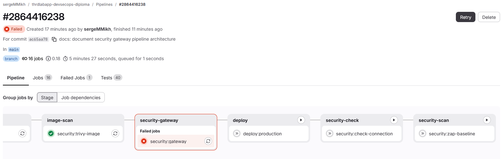
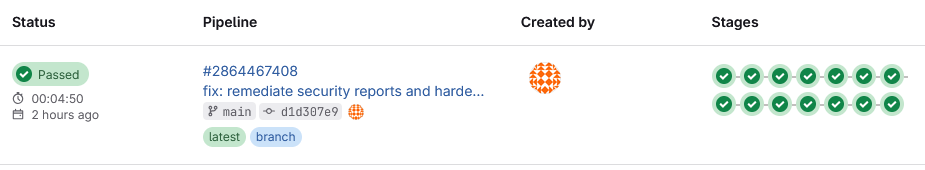

# THRDLabApp DevSecOps Diploma

Дипломный проект по треку **DevSecOps**.

Цель работы — построить безопасный CI/CD-пайплайн для веб-приложения с автоматизированными проверками безопасности и механизмом остановки небезопасного релиза.

Задание Нетологии: [sib-Diplom-Track-DevSecOps](https://github.com/netology-code/sib-Diplom-Track-DevSecOps)

Исходный репозиторий приложения: [THRDLabApp](https://github.com/sergeMMikh/thrdlabapp.git).

---

## План работы

Работа выполняется последовательно по этапам дипломного задания.

### Этап 0. Подготовка стенда и исходного проекта

Задачи:

- подготовить отдельный дипломный репозиторий;
- развернуть учебный VPS;
- настроить SSH-доступ по ключу;
- ограничить сетевой доступ с помощью UFW;
- контейнеризировать приложение;
- подготовить `Dockerfile` и `docker compose`;
- вынести конфигурацию и секреты в переменные окружения;
- развернуть приложение и PostgreSQL на учебном хосте;
- проверить доступность приложения извне;
- зафиксировать исходное состояние проекта и инфраструктуры.

Результат этапа:

- приложение воспроизводимо разворачивается на учебном VPS;
- PostgreSQL доступен только внутри Docker-сети;
- наружу опубликованы только необходимые сервисы;
- секреты не хранятся в репозитории.

<details>
<summary>Скриншоты</summary>

</br>
Список поднятых Docker контейнеров на целевом хосте

</br>

Web приложение

</br>

Панель администратора Django

</br>

Подключение git репозиториев

</br>

</details>

Ссылки на репозитории проекта:
* [Исходный проект](https://github.com/sergeMMikh/thrdlabapp.git)
* [GitLab](https://gitlab.com/sergeMMikh/thrdlabapp-devsecops-diploma.git)
* [DockerHub](https://hub.docker.com/repository/docker/sergemmikh/thrdlabapp-devsecops-diploma/general)

### Этап 1. CI/CD

Критерии задания:

1. настроенный пайплайн сборки и доставки программного обеспечения;
2. использование удалённого сервера для развёртывания;
3. документированный процесс.

#### Реализованная архитектура

Для CI/CD используется **GitLab CI/CD**, для хранения собранных контейнерных образов — **Docker Hub**, а целевой средой развёртывания является учебный VPS.

Принципиальное решение этапа — **не собирать приложение на целевом сервере**. Docker-образ является готовым версионируемым артефактом: он собирается в CI, публикуется в Docker Hub и после успешного прохождения предыдущих стадий доставляется на VPS.

Базовая последовательность pipeline:

```text
validate
   |
   v
auth
   |-- Docker Hub authentication
   `-- SSH authentication
   |
   v
lint
   |
   v
test (pytest)
   |
   +----------------------+----------------------+
   |                      |                      |
   v                      v                      v
SAST: Bandit         SAST: Semgrep          build:image
   |                      |                      |
   +----------------------+----------------------+
                          |
                          v
                       deploy
                          |
                          v
                security:check-connection
                          |
                          v
                security:zap-baseline
```

Docker-образ публикуется с тегом, соответствующим commit SHA. Это обеспечивает трассируемость:

```text
Git commit
    |
    v
GitLab pipeline
    |
    v
Docker image:<commit-sha>
    |
    v
Training VPS
```

Production Compose использует готовый `image:`, а не локальный `build:`. PostgreSQL хранит данные в постоянном Docker volume, поэтому пересоздание контейнера приложения и доставка нового образа не приводят к пересозданию базы данных. При старте приложения Django применяет только отсутствующие миграции.

Использование контейнерного образа как основного deployment artifact также позволяет в дальнейшем использовать тот же образ для развёртывания в Kubernetes без изменения принципа доставки приложения.

#### Автоматические тесты pytest

Перед сборкой и security-анализом выполняется отдельный CI job `test`. Pytest настроен через `setup.cfg`; тесты находятся в каталоге `tests`. Результаты публикуются в GitLab CI в формате JUnit (`pytest-report.xml`) и сохраняются как artifact.

В CI дополнительно устанавливаются Chromium и ChromeDriver, поскольку набор тестов включает Selenium-проверку реальной загрузки главной страницы в headless-браузере.

Текущий набор pytest покрывает:

- **модели и ограничения БД (`tests/main/test_models.py`)** — создание обычного пользователя и superuser, обязательность email/password, строковые представления моделей, генерация и уникальность email-токенов, связи Person с Furnace/Equipment, уникальность бронирований, значения и URL новостей, обновление объектов и каскадное удаление связанных записей;
- **основные Django views (`tests/main/test_views.py`)** — рендеринг Home/About/Contacts, группировка печей по лабораториям, вывод последних новостей, создание новости с валидными и невалидными данными, detail/update/delete для новости;
- **пользовательский API (`tests/users/test_user_views.py`)** — успешная и ошибочная регистрация, ограничения длины имени и email, login подтверждённого пользователя, запрет login неподтверждённого пользователя, подтверждение аккаунта, verification email, проверка authentication для редактирования профиля, изменение данных пользователя, запрос и подтверждение сброса пароля;
- **Selenium (`tests/main/test_test.py`)** — запуск headless Chromium против Django `live_server` и проверка загрузки главной страницы и её title;
- базовый smoke-test окружения pytest.

Сборка Docker-образа запускается только после успешного прохождения lint и функциональных тестов. Это не позволяет передавать в дальнейшие стадии код, не прошедший базовую проверку работоспособности.

#### Разделение runner-ов

На постоянно доступном WSL-хосте `DEM-PC1064` используются три регистрации GitLab Runner с Docker executor. Глобальная параллельность runner manager настроена через `concurrent = 3`.

Роли разделены тегами:

```text
Build runner
  tags: thrdlabapp, docker, build
  jobs: validate, Docker Hub auth, lint, pytest, build:image

SAST runner
  tags: thrdlabapp, security, sast
  jobs: Bandit, Semgrep

DAST runner
  tags: thrdlabapp, security, dast
  jobs: HTTPS availability check, OWASP ZAP Baseline Scan
```

Build runner использует `privileged = true`, необходимый для Docker-in-Docker. Security runners работают без privileged mode, если конкретная проверка не требует обратного.

При настройке CD было выявлено сетевое ограничение: сеть, в которой работает основной self-hosted WSL runner, блокирует исходящие подключения к SSH-порту целевого VPS. Поэтому SSH authentication и deployment выполняются GitLab-hosted runner-ом, имеющим сетевой доступ к целевому серверу. DAST выполняется с self-hosted DAST runner через стандартный HTTPS-порт 443.

#### Разделение ответственности

```text
GitHub                 — основной репозиторий проекта и документации
GitLab                 — CI/CD pipeline
DEM-PC1064 Build       — lint, pytest, Docker build/push
DEM-PC1064 SAST        — Bandit, Semgrep
DEM-PC1064 DAST        — HTTPS pre-check, OWASP ZAP
GitLab-hosted Runner   — deployment transport до VPS
Docker Hub             — registry готовых Docker-образов
VPS                    — целевая среда развёртывания
```

#### Реализовано

- создан GitLab-репозиторий и подключён отдельным Git remote;
- подготовлен `.gitlab-ci.yml`;
- настроены protected CI/CD variables;
- отдельно проверяется наличие обязательных переменных;
- проверена аутентификация в Docker Hub и SSH-аутентификация на VPS;
- настроены специализированные self-hosted GitLab Runners с Docker executor;
- реализован lint через отдельный `requirements-lint.txt`;
- добавлен автоматический запуск pytest с публикацией JUnit-отчёта;
- для Selenium-теста CI-среда дополнена Chromium и ChromeDriver;
- Docker-образ собирается после успешных lint и pytest;
- образ публикуется в Docker Hub с тегом commit SHA;
- подготовлен `compose.prod.yaml`, использующий готовый Docker image;
- настроен автоматический deployment по SSH;
- PostgreSQL использует постоянный Docker volume;
- после автоматического deployment подтверждена работоспособность Django-приложения на учебном VPS.

### Этап 2. SAST

Критерии задания:

1. покрытие исходного кода проверками;
2. автоматический запуск проверок во время сборки;
3. выгрузка результатов в CI или систему управления уязвимостями.

#### Выбор инструментов

Для SAST используются два взаимодополняющих инструмента:

- **Bandit** — специализированный анализатор безопасности Python-кода;
- **Semgrep** — rule-based SAST-анализатор с более широким набором правил для Python/Django и web-паттернов.

Bandit устанавливается из отдельного `requirements-security.txt`, чтобы security tooling не смешивался с runtime-зависимостями приложения. Semgrep запускается в отдельном контейнерном образе.

#### Реализация в GitLab CI/CD

Добавлены два CI job:

```text
sast:bandit
sast:semgrep
```

Оба назначены выделенному SAST runner через теги `thrdlabapp, security, sast`.

После успешного `test` pipeline разрешает независимый запуск трёх ветвей:

```text
                         +--> sast:bandit -----> bandit-report.json
                         |
test --------------------+--> sast:semgrep ----> semgrep-report.json
                         |
                         +--> build:image ------> Docker Hub
```

Для jobs используются `needs: [test]`, поэтому SAST и сборка могут выполняться параллельно при наличии свободных runner slots.

Результаты анализаторов сохраняются в GitLab CI как artifacts сроком на одну неделю:

```text
bandit-report.json
semgrep-report.json
```

На этапе первичного внедрения SAST найденные проблемы **не блокируют release**. Цель Этапа 2 — обеспечить воспроизводимый автоматический анализ, получить baseline, классифицировать findings и отделить подтверждённые проблемы от false positives. На Этапе 5 (Security Gateway) результаты SAST вместе с другими security checks будут оцениваться по severity и смогут блокировать release.

Текущий статус этапа:

- Bandit интегрирован в GitLab CI/CD;
- Semgrep интегрирован в GitLab CI/CD;
- SAST запускается автоматически после pytest;
- отчёты сохраняются как CI artifacts;
- включён report-only режим до формирования baseline.

### Этап 3. DAST

Критерии задания:

1. покрытие работающего сервиса динамическими проверками;
2. успешный запуск доступных методов сканирования;
3. выгрузка результатов в CI или систему управления уязвимостями.

#### HTTPS endpoint для динамического анализа

Для DAST приложение опубликовано через отдельное DNS-имя **`diploma.smmikh.pt`** и доступно по HTTPS на стандартном порту 443.

На учебном VPS перед Django/Gunicorn установлен **Nginx**, выполняющий роль reverse proxy:

```text
Internet / DAST runner
        |
     HTTPS :443
        |
        v
      Nginx
        |
        v
  Django / Gunicorn :8000
        |
        v
    PostgreSQL
```

Gunicorn не используется как публичная HTTPS-точка входа. Внешний доступ к порту 8000 закрыт UFW; наружу для web-приложения открыты стандартные порты 80/443. Порт 80 используется для HTTP/ACME и перенаправления на HTTPS, а рабочая точка доступа приложения и DAST — HTTPS/443.

TLS-сертификат для `diploma.smmikh.pt` выпущен **Let's Encrypt** и установлен в Nginx. Проверены корректная TLS-цепочка и автоматическое продление сертификата с помощью `certbot renew --dry-run`. Это позволяет DAST runner и OWASP ZAP обращаться к стенду по обычному доверенному HTTPS без отключения проверки сертификата и без добавления self-signed CA.

#### Реализация DAST в GitLab CI/CD

Для динамического анализа используется **OWASP ZAP Baseline Scan**. Проверка выполняется выделенным runner `DEM-PC1064-3` с тегами:

```text
thrdlabapp, security, dast
```

После deployment выполняются две последовательные стадии:

```text
deploy:production
       |
       v
security:check-connection
       |
       v
security:zap-baseline
       |
       +--> zap-report.json
       +--> zap-report.html
       `--> zap-report.md
```

`security:check-connection` выполняет быстрый HTTPS pre-check через `curl`. Если приложение недоступно, динамический анализ не запускается. Это позволяет отличить сетевую/инфраструктурную ошибку от результата security scanner.

После успешной проверки доступности `security:zap-baseline` запускает официальный контейнер OWASP ZAP и выполняет passive/baseline анализ развернутого приложения. Отчёты сохраняются в GitLab CI artifacts сроком на одну неделю в трёх форматах:

```text
zap-report.json
zap-report.html
zap-report.md
```

На текущем этапе ZAP работает в **report-only** режиме: findings сохраняются и анализируются, но сами предупреждения ещё не блокируют release. Политика блокировки будет реализована на Этапе 5 (Security Gateway).

#### Результат baseline scan

Первый успешный baseline scan обработал **29 URL** приложения. Итог ZAP:

```text
FAIL-NEW: 0
WARN-NEW: 12
PASS: 55
```

Критических результатов уровня `FAIL` baseline scan не выявил. При этом сформирован baseline из 12 типов предупреждений, среди которых:

- cookie без `HttpOnly`;
- cookie без `Secure`;
- отсутствие HSTS (`Strict-Transport-Security`);
- отсутствие Content Security Policy (CSP);
- отсутствие Permissions Policy;
- потенциально управляемые HTML-атрибуты (Potential XSS);
- замечания к cache-control/cacheable content;
- Cross-Domain Misconfiguration;
- отсутствие Subresource Integrity для части ресурсов;
- дополнительные browser isolation/security headers.

Эти результаты не считаются автоматически подтверждёнными уязвимостями: на следующих этапах findings будут классифицированы, проверены на false positives и сопоставлены с допустимым уровнем риска.

#### Результат этапа

- развернутое приложение доступно DAST runner по доверенному HTTPS;
- настроены Nginx reverse proxy и сертификат Let's Encrypt;
- внешний порт приложения 8000 закрыт, DAST выполняется через HTTPS/443;
- реализован отдельный pre-check доступности приложения;
- OWASP ZAP Baseline Scan интегрирован в GitLab CI/CD;
- DAST выполняется автоматически после deployment;
- baseline scan успешно обработал 29 URL;
- результаты DAST сохраняются как JSON/HTML/Markdown artifacts;
- получен baseline: `0 FAIL`, `12 WARN`, `55 PASS`;
- pipeline с Этапом 3 успешно завершён.

### Этап 4. Security Checks

Критерии задания:

1. проверка репозитория на секреты;
2. проверка конфигурации или контейнерных образов.

План реализации:

- secret scanning — TruffleHog;
- dependency scanning — pip-audit и/или Trivy;
- container image scanning — Trivy;
- Dockerfile / configuration checks;
- проверка CI/CD и deployment-конфигурации;
- формирование SBOM при необходимости;
- сохранение отчётов в artifacts.

Контролируемые области:

```text
source code
    |
    +-- secrets
    +-- dependencies
    +-- configuration
    +-- Dockerfile
    +-- container image
    +-- CI/CD configuration
```

#### Оптимизация pipeline для разработки по этапам

По мере расширения CI/CD полный pipeline стал включать lint, функциональные тесты, SAST, сборку и публикацию Docker-образа, deployment, DAST и дополнительные security-проверки. Полный прогон начал занимать значительное время — в отдельных запусках до 10 минут. Для ускорения разработки было принято решение выполнять работу над крупными этапами диплома в отдельных защищённых ветках с укороченным pipeline.

Для Этапа 4 используется ветка `stage_4`. При push в неё запускаются только проверки, относящиеся к Security Checks, а ранее реализованные lint/test/SAST/build/deploy/DAST jobs пропускаются. После завершения этапа изменения переносятся в `main`, где выполняется полный интеграционный pipeline со всеми стадиями.

Такой подход уменьшает время обратной связи при разработке отдельных security jobs, снижает лишнюю нагрузку на runner-ы и при этом сохраняет обязательную полную проверку интегрированного решения в основной ветке.

#### Реализация Security Checks

На текущем этапе добавлены:

- **TruffleHog** — поиск секретов по Git-истории репозитория; результат сохраняется в `trufflehog-report.json`;
- **pip-audit** — проверка Python-зависимостей из `requirements.txt` на известные уязвимости; результат сохраняется в `pip-audit-report.json`;
- **Trivy filesystem scan** — анализ файловой системы репозитория на уязвимые зависимости, секреты и misconfiguration; результат сохраняется в `trivy-fs-report.json`;
- **Trivy config scan** — отдельная проверка Dockerfile и инфраструктурной конфигурации; результат сохраняется в `trivy-config-report.json`.

На Этапе 4 security scanners формируют отчёты и сохраняют их как CI artifacts. Дополнительно Docker-образ текущего commit проверяется Trivy после сборки (`trivy-image-report.json`). Решение о блокировке релиза вынесено в отдельный Security Gateway на Этапе 5.

### Этап 5. Security Gateway

Критерии задания:

1. остановка релиза при наличии недопустимых уязвимостей;
2. дополнительные автоматизированные действия: комментарии в MR и рекомендации по исправлению.

План реализации:

- определить правила допуска релиза;
- блокировать deployment при критических результатах security scans;
- определить допустимые уровни `Critical`, `High`, `Medium`, `Low`;
- агрегировать результаты SAST, DAST, secret scanning и container scanning;
- выводить понятный Security Summary в GitLab CI/CD;
- публиковать информацию о проблемах в merge request;
- документировать исключения и false positives.

Целевая схема pipeline:

```text
push в рабочую ветку
        |
        +--> lint
        `--> pytest

Merge Request --> main
        |
        +--> lint / pytest
        +--> Bandit / Semgrep
        +--> TruffleHog
        +--> pip-audit
        +--> Trivy fs/config
        `--> Security feedback в MR

merge / push --> main
        |
        +--> полный набор проверок
        +--> build:image
        +--> Trivy image
        |
        v
Security Gateway
        |
   +----+----+
   |         |
 BLOCK      PASS
             |
             v
           Deploy
             |
             v
            DAST
```

Production deployment разрешён только из ветки `main`. Security Gateway блокирует deployment при обнаружении verified secrets, а также findings уровня HIGH/CRITICAL в блокирующих проверках. Medium/Low и результаты, не имеющие надёжного severity mapping, сохраняются для анализа и не блокируют релиз автоматически.

Для Merge Request выполняется расширенный набор source-level security checks и автоматически публикуется Security Summary с рекомендациями через GitLab API. Сборка и публикация production Docker image остаются только в доверенном pipeline ветки `main`, чтобы registry credentials не передавались коду из произвольной рабочей ветки.


#### Проверка блокировки релиза и исправление уязвимостей

При первом интеграционном запуске Security Gateway контейнерный и filesystem-анализ Trivy обнаружил недопустимые findings уровня HIGH/CRITICAL. Job `security:gateway` завершился с ошибкой, а зависимые стадии `deploy:production`, `security:check-connection` и `security:zap-baseline` не были запущены. Это подтверждает, что release gate фактически останавливает доставку небезопасного релиза до production.



В отчёте Gateway были зафиксированы, в частности, уязвимости устаревшей зависимости `Django==4.0.4`. В качестве remediation выполнен переход на поддерживаемую LTS-ветку Django 5.2 с сохранением совместимости с используемым в CI Python 3.10.

Во время remediation была также выявлена ошибка управления версиями: первоначально была указана ещё не опубликованная версия `Django==5.2.18`. `pip install -r requirements.txt` корректно остановил pipeline сообщением `No matching distribution found for Django==5.2.18`; доступной версией в используемом package index была `5.2.17`. Зависимость скорректирована до `Django==5.2.17`, после чего pipeline должен повторно выполнить функциональные и security-проверки до разрешения deployment.

Результаты security-проверок и итоговый отчёт Security Gateway сохраняются в GitLab CI/CD как artifacts, включая `security-gateway-report.md`, `security-gateway-report.json` и исходные отчёты сканеров. Для Gateway используется `artifacts: when: always`, поэтому диагностические материалы сохраняются и при заблокированном релизе и могут быть использованы для последующего анализа и remediation.

Таким образом, Stage 5 демонстрирует полный цикл: **обнаружение → блокировка релиза → анализ причины → remediation → повторная проверка**.

Послке утсранения обнаруженных недостатков и решения проблемы зависимостей итоговый резульат- прохождения всех проверок.



Результаатом работы является веб-сайт по адресу https://diploma.smmikh.pt/


### Результаты и итоговая документация

В результате дипломной работы построен полный DevSecOps pipeline для Django-приложения, объединяющий функциональные проверки, сборку и публикацию Docker image, автоматизированный deployment и несколько уровней анализа безопасности.

В CI/CD интегрированы:

- lint и автоматические тесты pytest;
- SAST с использованием Bandit и Semgrep;
- поиск секретов с TruffleHog;
- аудит Python-зависимостей с pip-audit;
- анализ filesystem, конфигурации и container image с Trivy;
- DAST работающего HTTPS-приложения с OWASP ZAP;
- Security Gateway, принимающий решение о допуске релиза к deployment;
- сохранение результатов проверок и итоговых security reports в GitLab CI artifacts;
- Security Summary и рекомендации для Merge Request.

Практическая проверка показала, что механизм release gate работает не только как средство формирования отчётов. При обнаружении HIGH/CRITICAL findings Security Gateway остановил pipeline до стадии production deployment. Результаты сканирования при этом были сохранены как artifacts и использованы для анализа причин.

В ходе remediation была обновлена уязвимая версия Django и устранены обнаруженные исправляемые проблемы зависимостей. Повторные проверки показали исчезновение CRITICAL findings, а результаты pip-audit и Trivy filesystem были приведены к допустимому состоянию. Оставшиеся findings container image были проанализированы с учётом наличия исправлений и политики допуска релиза.

После remediation повторный pipeline успешно прошёл все стадии: функциональные проверки, security scans, Security Gateway, deployment и последующий DAST. Тем самым продемонстрирован полный цикл DevSecOps:

**изменение кода → CI → автоматические security checks → Security Gateway → remediation при необходимости → повторная проверка → deployment → DAST.**

Итоговая реализация обеспечивает воспроизводимую сборку и доставку приложения, сохраняет evidence выполненных проверок и предотвращает автоматический выпуск релиза, не соответствующего заданным security-критериям.

---

## Планируемые и используемые инструменты

| Задача | Инструмент |
|---|---|
| Source / documentation | GitHub |
| CI/CD | GitLab CI/CD |
| CI runners | Self-hosted GitLab Runner / WSL / Docker executor |
| Deployment runner | GitLab-hosted Runner |
| Container registry | Docker Hub |
| Containerization | Docker / Docker Compose |
| Reverse proxy / HTTPS | Nginx / Let's Encrypt / Certbot |
| Functional tests | pytest, Selenium, Chromium |
| Web application | Django / Gunicorn |
| Database | PostgreSQL |
| SAST | Semgrep, Bandit |
| Dependency scanning | pip-audit, Trivy |
| Secret scanning | TruffleHog |
| Container scanning | Trivy |
| DAST | OWASP ZAP |
| Security reports | GitLab CI artifacts / reports |
| Security Gateway | GitLab CI jobs, rules and release conditions |

Перечисленные инструменты составляют итоговый набор средств, использованных для реализации DevSecOps pipeline.

---

## Принципы выполнения работы

При разработке pipeline придерживаемся следующих правил:

- каждый этап сначала реализуется и проверяется отдельно;
- Docker-образ является основным версионируемым артефактом доставки;
- целевой сервер не используется как build-среда приложения;
- security checks являются частью CI/CD, а не отдельной ручной процедурой;
- реальные секреты не коммитятся в Git и не включаются в Docker image;
- результаты проверок сохраняются и доступны для анализа;
- найденные уязвимости не только фиксируются, но и анализируются;
- false positives документируются;
- критические проблемы должны иметь возможность остановить релиз;
- deployment credentials должны быть доступны только jobs, которым они действительно необходимы;
- все ключевые решения и результаты отражаются в документации.

---

## Статус выполнения

| Этап | Статус |
|---|---|
| 0. Подготовка стенда | Выполнен |
| 1. CI/CD | Выполнен: lint, pytest, build и deployment |
| 2. SAST | Выполнен: Bandit и Semgrep интегрированы, отчёты сохраняются в CI |
| 3. DAST | Выполнен: HTTPS endpoint, pre-check и OWASP ZAP Baseline Scan интегрированы |
| 4. Security Checks | Выполнен: TruffleHog, pip-audit, Trivy filesystem/config и container image scanning |
| 5. Security Gateway | Выполнен: release gate, MR feedback, сохранение artifacts и блокировка небезопасного deployment |

Все этапы дипломной работы выполнены; README содержит итоговую архитектуру, результаты проверок и evidence работы DevSecOps pipeline.
